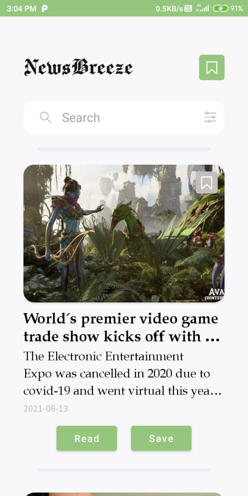
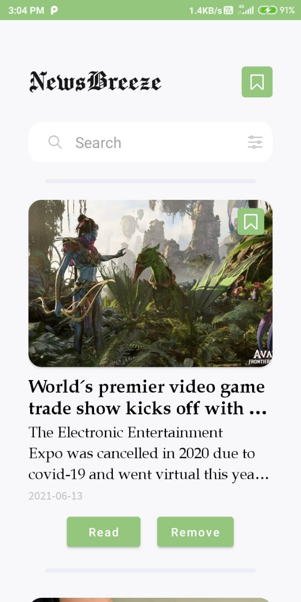
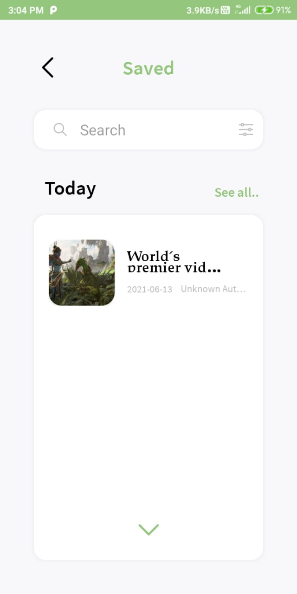

# **News Breeze App**

_Version 1.0.0_

---

## **Description**

---

The `initial screen` will display all the latest news headlines within India. You can scroll through the page vertically and see them. Each article has an image, a title, a short description, upload date, a `read` and `save` button. On clicking the article content or the `read` button the app will redirect you to the full screen page for that particular article. And if you click the `save` button you will be able to view that news article on a later time in the save screen.

---

The `second screen` will display the full page article. Here you will also be able to see the Author and the content of the article, as well as `save` the article.

---

The `final screen` will display all the saved articles. And you will be able to look through the full article by clicking them.

---

## **Contributors**

- Justin P Jose [ <justinjose1005@gmail.com> ]
